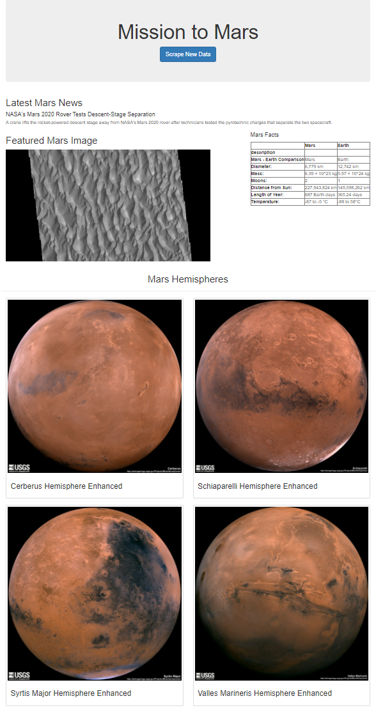
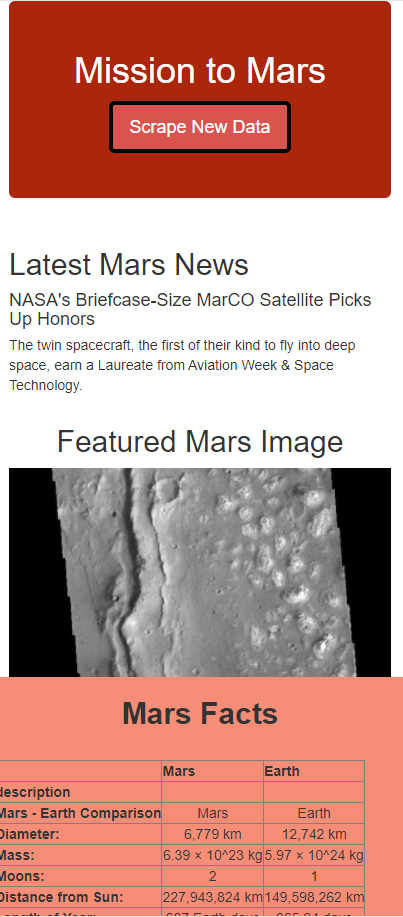
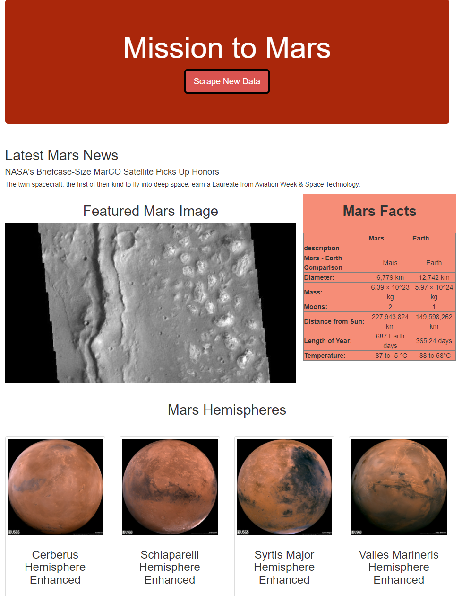

# Mission-to-Mars

## Overview of the Challenge
The purpose of this challenge is to help Robin build her web app. she's excited about an opportunity to work with NASA and hope the app would bring some attention to her. This challenge calls for scraping numerous websites for images and text articles. Additionally, to save time, there needs to be a button that can do all the updating instantly. 

## Result
After completing the scrape, the website was able to return the latest article and necessary images from the desire website. The button also works in getting the latest news. An additional feature while creating this web app was to make the components dynamic so it can fit into any device's viewing screen size. This was done using the "class = img-responsive" format in HTML code. After knowing that the web app works, it is time for some customization and make it stand out. Below are some screenshots of what the web app looks like.

| Original Page | Mobile View | Customized Page |
| :--: | :--: | :--: | 
|  |  | |

## Summary
With the ability to scrape new data in an instant and the endless customization possibilites, Robin can surely stand out. While it make take a long time to build the web app, the maintance of it is a breeze. This project combines the use of multiple tools, such as BeautifulSoup, Splinter, Pandas, HTML, Bootstrap, along with the skills of writing codes in Jupyter Notebook and Python. 
